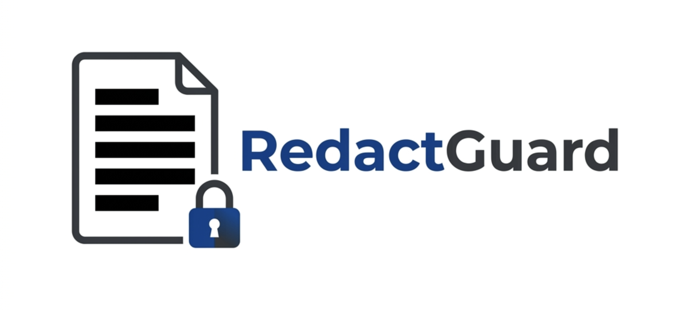
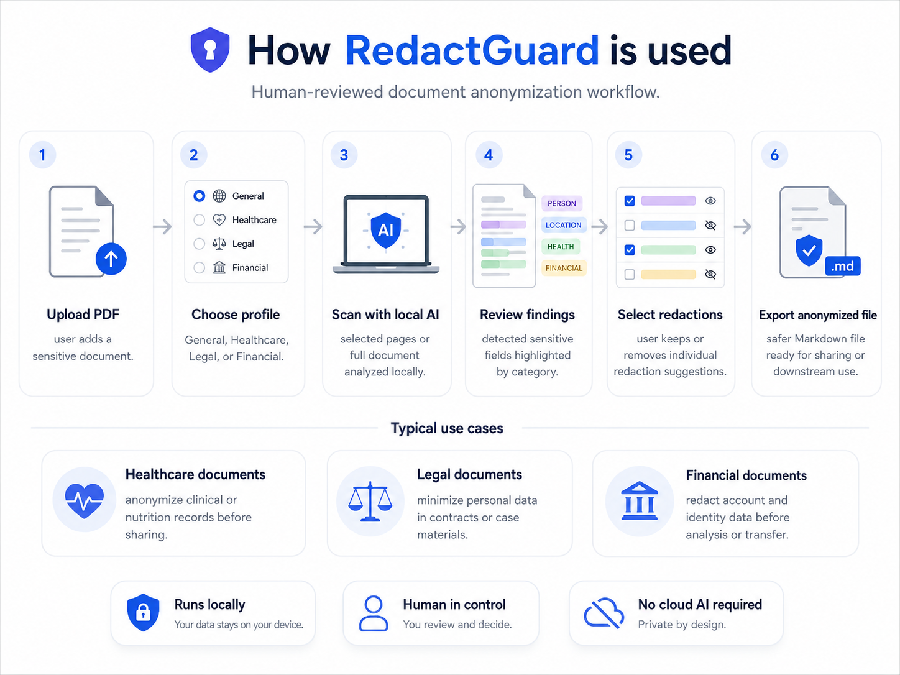
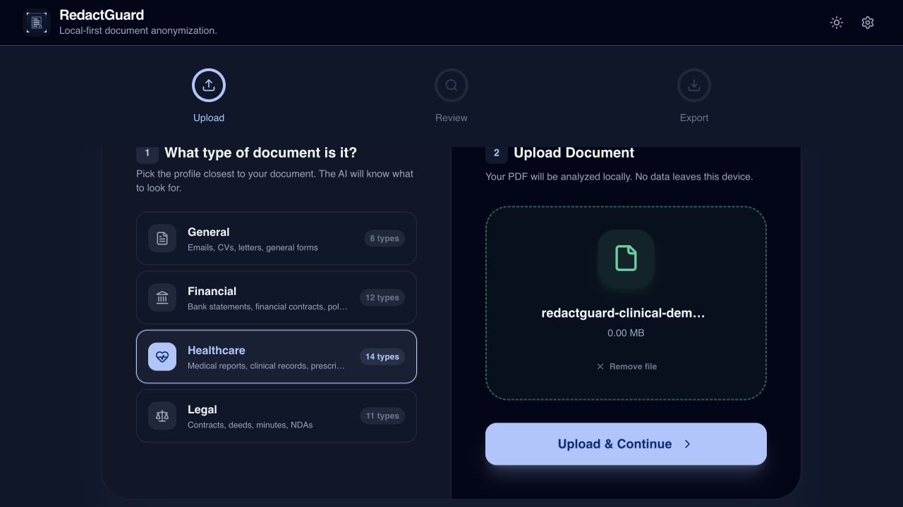
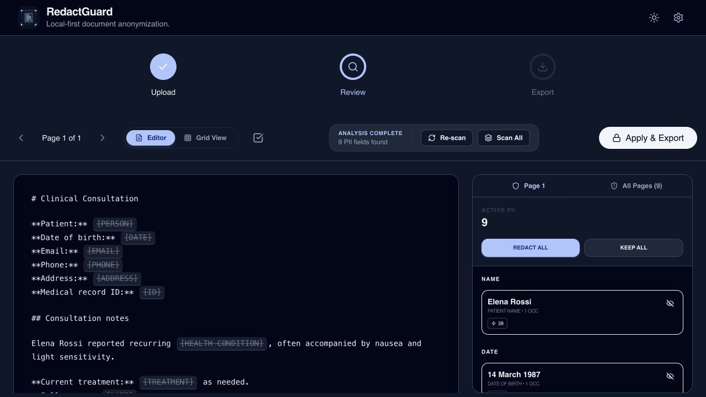
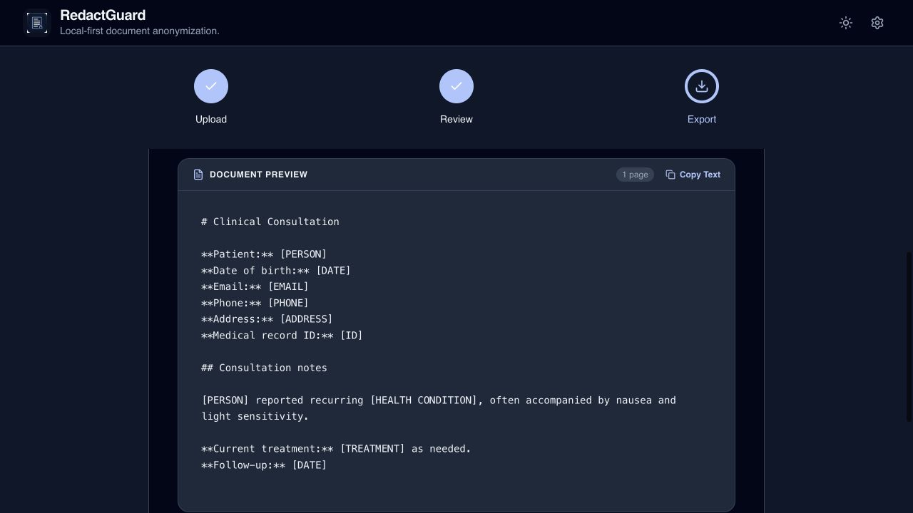
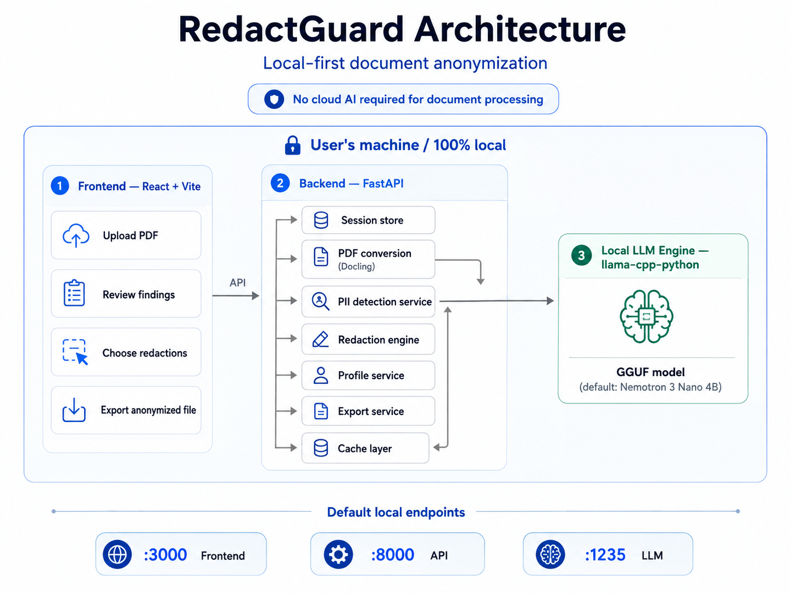

<div align="center">



# RedactGuard

**Configurable PII detection, local by design, human-reviewed.**

RedactGuard lets you define what sensitive information means for your domain or organization, then applies that taxonomy through a local document-anonymization pipeline. Start from a built-in profile, add or edit organization-specific PII definitions, scan documents locally, review every finding, and export only the minimized result.

**The key idea: PII definitions are configuration, not application code.**

[Why RedactGuard](#why-redactguard-exists) · [Configurable PII](#pii-definitions-are-configuration-not-code) · [How it works](#what-redactguard-does) · [Screens](#product-walkthrough) · [Value](#why-use-redactguard) · [Architecture](#architecture) · [Privacy](#privacy-and-data-lifecycle) · [Run locally](#run-locally)

</div>

## Why RedactGuard exists

There is no universal list of sensitive information that works for every organization.

A healthcare workflow may need to detect patient identifiers, diagnoses, treatments, and measurements. A financial workflow may care about account identifiers and banking information. A company may also need to protect employee IDs, client codes, internal project names, contract references, or other domain-specific information that a generic PII detector does not know about.

Most anonymization approaches force an uncomfortable trade-off:

- hard-coded detectors are difficult to adapt as privacy requirements change;
- regex and pattern matching struggle with contextual information;
- cloud AI can require the original document to leave the user's machine;
- manual redaction is slow and inconsistent;
- fully automatic redaction removes human judgment where mistakes matter.

RedactGuard separates **the privacy policy** from **the anonymization engine**:

> **Define what is sensitive. RedactGuard adapts the detection pipeline.**

The detection taxonomy can evolve without rewriting the document-processing pipeline. Local contextual inference applies the active taxonomy, the user reviews the findings, and deterministic redaction is applied only after confirmation.

> [!IMPORTANT]
> RedactGuard is an experimental privacy tool, not a legal compliance product. Local AI can miss, misclassify, or over-detect sensitive information. Every result must be reviewed by a person before the exported document is shared or relied upon.

## PII definitions are configuration, not code

RedactGuard treats the list of sensitive information as a maintainable policy layer.

Built-in YAML profiles provide reusable starting points for common domains, while custom definitions let users extend or override that taxonomy for their own organization or workflow.

A custom PII definition contains a machine-readable name plus a natural-language description of what the local model should identify. Users can **add, edit, rename, and remove** these definitions from the PII Taxonomy settings without changing detection code.

For example, an organization can add:

```text
Name: Employee ID
Key: employee_id
Definition: Internal employee identifiers assigned by the organization,
including values such as EMP-10482.
```

That definition becomes part of the active detection instructions automatically. The next analysis looks for that information alongside the selected base profile.

The design is intentionally modular:

**Configurable taxonomy → Local contextual detection → Human review → Deterministic redaction → Controlled export**

Changes to the profile or custom PII definitions also change the inference prompt and therefore the configuration-aware cache key. Old results are not silently reused with an incompatible taxonomy.

> **🖼️ Visual placeholder — PII Taxonomy overview**  
> Final asset: `docs/assets/screenshots/redactguard-pii-taxonomy.jpg`  
> Show the real PII Taxonomy UI with base profiles plus custom definitions such as Employee ID, Client Code, and Internal Project Name. Edit/delete controls should be visible. The screenshot should make one thing obvious without reading the caption: **the user controls what RedactGuard considers sensitive.**

> **🖼️ Visual placeholder — Edit a custom PII definition**  
> Final asset: `docs/assets/screenshots/redactguard-pii-editor.jpg`  
> Show one custom definition in edit mode with a friendly name, natural-language detection description, Save, and Cancel. The image should communicate that taxonomy maintenance is self-service, not a development task.

The complete visual brief is documented in [`docs/00-discovery/03-configurable-pii-product-principle.md`](docs/00-discovery/03-configurable-pii-product-principle.md).

## Part of a broader local-first mission

RedactGuard also starts from a broader principle: **make AI useful without making the cloud the default destination for sensitive data.**

Local-first means keeping sensitive information close to the user whenever possible, making processing boundaries explicit, reducing unnecessary data exposure, and preserving meaningful user control over what leaves the device.

For RedactGuard, this means:

- **Configurable by design** — sensitive-data policy can evolve independently from the engine.
- **Local by default** — document conversion and inference are designed to run on the user's machine.
- **Privacy by architecture** — document processing does not require cloud inference or a remote document store.
- **Human in control** — model findings are suggestions; review and redaction decisions stay with the user.
- **Minimize before sharing** — reduce sensitive content before the document enters another workflow.

Local-first is therefore a major product advantage, but not the only reason to use RedactGuard. The core operational advantage is that teams can maintain what they consider sensitive without rebuilding the anonymization pipeline.

## What RedactGuard does

RedactGuard provides an end-to-end workflow:

1. **Configure the PII taxonomy** — use a base profile and maintain custom definitions.
2. **Import a PDF** and select the closest detection profile.
3. **Convert the document to structured Markdown** with Docling.
4. **Analyze selected pages or the full document** with a local GGUF model using the active taxonomy.
5. **Highlight detected sensitive fields** by category and page.
6. **Review each finding** and choose what should be redacted.
7. **Apply deterministic replacements** to the selected fields.
8. **Export an anonymized Markdown file** for safer downstream use.

<p align="center">
  
</p>

## Product walkthrough

The product is designed around two connected tasks: maintain the privacy policy and apply it to documents.

### 1. Define what should be treated as sensitive

Open **PII Taxonomy** to inspect the built-in profiles and maintain organization-specific definitions. Custom definitions are stored locally and automatically layered on top of the selected base profile.

> **🖼️ Visual placeholder — Configuration → detection proof**  
> Final asset: `docs/assets/screenshots/redactguard-config-to-detection.jpg`  
> Use a two-panel composition: on the left, a custom `employee_id` definition; on the right, the review screen detecting synthetic value `EMP-10482` as that PII type. This image should visually prove that changing the taxonomy changes what the engine looks for.

### 2. Choose a profile and load a PDF

Select the profile closest to the document. Each profile provides a domain-specific starting taxonomy; custom definitions are layered on top automatically. The file remains on the device throughout the workflow.



### 3. Review the detected sensitive data

The local model groups findings by category. The editor shows the redacted preview immediately, while the side panel lets the user review each occurrence, keep selected values, or redact everything.



### 4. Export the anonymized output

After confirmation, RedactGuard creates a clean Markdown version that can be copied directly or downloaded for downstream use.



> [!NOTE]
> The walkthrough uses synthetic data created specifically for documentation. It contains no real personal or health data, and the displayed findings are illustrative rather than a model benchmark.

### Typical use cases

- **Organization-specific privacy policies** — protect internal identifiers, client codes, project names, or other sensitive categories unique to a team.
- **Healthcare documents** — minimize identifiers and sensitive clinical or nutrition information before sharing.
- **Legal documents** — review personal and contextual data in contracts, case materials, or other sensitive documents.
- **Financial documents** — redact account, identity, and personal information before analysis or transfer.
- **AI workflows** — create a minimized version of a document before it is passed to another AI system that does not need the original sensitive fields.

## Why use RedactGuard

| Need | RedactGuard's contribution |
|---|---|
| Adapt anonymization to your organization | Add, edit, rename, or remove custom PII definitions without changing detection code. |
| Start quickly in a known domain | Built-in general, healthcare, legal, and financial profiles provide reusable starting taxonomies. |
| Keep privacy policy maintainable | The taxonomy is separate from the detection and redaction engine, so the policy can evolve independently. |
| Avoid cloud exposure | Conversion, inference, review, redaction, and export are designed to run on the user's machine. |
| Go beyond regex-only detection | A local LLM can identify contextual information such as health conditions, treatments, demographics, measurements, or organization-specific concepts. |
| Preserve human control | Findings are suggestions, not irreversible decisions. Every field can be included or excluded. |
| Avoid stale inference after policy changes | Model, prompt, profile, and custom-type configuration are part of cache-key behavior. |
| Make minimization operational | Configuration, detection, review, redaction, deletion controls, and explicit export are combined in one workflow. |

The key value is not simply "running an LLM locally". RedactGuard combines **maintainable privacy policy + local contextual detection + human review + deterministic data minimization** into one workflow.

## Core capabilities

### Configurable PII taxonomy

Built-in YAML profiles are available for:

- **General** documents;
- **Healthcare** and clinical information;
- **Legal** and contractual documents;
- **Financial** and banking information.

The built-in taxonomy covers categories including:

- people, emails, phone numbers, addresses, dates, and URLs;
- account numbers and secrets;
- health conditions, treatments, and laboratory results;
- personal measurements, demographics, and lifestyle information.

Custom PII definitions can be maintained through the UI and API. They are persisted locally and merged into the active taxonomy. A custom definition with the same name as a profile definition takes precedence.

### Local AI processing

- GGUF inference through `llama-cpp-python`;
- NVIDIA Nemotron 3 Nano 4B Q4_K_M as the default model;
- configurable model path and inference parameters;
- local HTTP endpoints used by the application backend;
- no cloud inference required for document processing.

### Structured document extraction

- PDF upload with size validation;
- PDF-to-Markdown conversion through Docling;
- page-level document representation;
- table normalization before PII analysis;
- SHA-256-based conversion cache.

### Human-in-the-loop review

- color-coded highlights in the document preview;
- per-field redaction controls;
- page-by-page analysis;
- selective page inference;
- sequential full-document scanning;
- cross-page findings in a unified sidebar;
- direct navigation from a finding to its source page.

### Controlled export

- redaction runs only after user confirmation;
- findings default to redacted unless explicitly excluded;
- replacements are applied deterministically from the reviewed result set;
- the current export format is Markdown (`.md`);
- exports use an `_anonymized.md` suffix.

### Local caching

RedactGuard maintains separate local caches for PDF conversion and LLM inference results.

Cache keys include the source content and relevant model or prompt configuration. Changing the model, prompt, profile, or custom PII definition creates a new key rather than reusing an incompatible result.

## Privacy and data lifecycle

RedactGuard is local-first by architecture, but local processing does not mean data disappears automatically. The application therefore makes local persistence explicit.

| Data | Where it is handled | Default lifecycle | User control |
|---|---|---|---|
| Uploaded PDF bytes | Local backend during conversion | Not stored in a remote service | Stop/reset the workflow |
| Parsed document pages | In-memory session and optional local cache | Session expiry and cache TTL | Clear cache through the UI/API |
| PII findings | In-memory session and optional local cache | Session- and cache-bound | Review, override, or clear cache |
| Custom PII definitions | Local application data | Persist across sessions | Add, edit, rename, or delete through settings/API |
| Exported Markdown | User's local filesystem | Persists until deleted | Full filesystem control |
| GGUF model | Local model directory | Persists for reuse | Replace or delete the model |

Default privacy properties:

- services bind to `127.0.0.1`;
- sessions are stored in memory rather than a database;
- idle sessions are cleaned up automatically;
- cache data is stored under `~/.cache/redactguard` by default;
- PDF and LLM caches have configurable TTL and size limits;
- caches can be cleared by namespace or in full;
- no user account, cloud database, or remote document store is required.

The initial model download can contact Hugging Face. Once the model and dependencies are available, the document-processing workflow is designed to remain local.

> [!NOTE]
> Do not place the cache directory on shared or network-mounted storage when handling sensitive documents. Clear the cache after high-sensitivity sessions when local persistence is not desired.

## Architecture

RedactGuard uses three local processes with explicit responsibilities. The frontend manages taxonomy configuration, upload, review, and export; the FastAPI backend orchestrates document conversion, PII policy/profile management, detection, redaction, sessions, and caching; and a dedicated local `llama-cpp-python` process hosts the GGUF model used for contextual detection.

<p align="center">
  
</p>

| Process | Default port | Responsibility |
|---|---:|---|
| React/Vite frontend | `3000` | PII taxonomy settings, upload, profile selection, review, redaction controls, and export UI |
| FastAPI backend | `8000` | Profiles/custom PII, sessions, conversion, analysis, redaction, cache, and export |
| Local LLM server | `1235` | GGUF model loading and local contextual inference |

### Technology stack

- **Frontend:** React 19, TypeScript, Vite, Tailwind CSS v4, Motion, Lucide;
- **Backend:** Python 3.13, FastAPI, Pydantic;
- **Document processing:** Docling;
- **Local inference:** `llama-cpp-python` and GGUF;
- **PII taxonomy:** YAML base profiles plus locally persisted custom definitions;
- **Caching:** `diskcache`;
- **Desktop packaging:** Tauri 2, currently experimental.

## Run locally

The source workflow is currently optimized for macOS development, particularly Apple Silicon. Linux and Windows are architectural targets but may require platform-specific dependency and inference settings.

### Prerequisites

- Git;
- Node.js 20+;
- pnpm 9;
- Python 3.13;
- sufficient RAM for the selected GGUF model;
- the native build tools required by `llama-cpp-python` and Docling.

On macOS:

```bash
brew install node pnpm python@3.13
```

### 1. Clone the repository

```bash
git clone https://github.com/daniele21/redact-guard.git
cd redact-guard
```

### 2. Create the Python environment

```bash
chmod +x setup_env.sh
./setup_env.sh
```

The script creates `.venv`, installs the backend dependencies, and enables Metal support for `llama-cpp-python` on macOS.

### 3. Install frontend dependencies

```bash
pnpm install
```

### 4. Provide a GGUF model

Download the default model:

```bash
pnpm tauri:download-model
```

The default destination is:

```text
~/.redactguard/models/NVIDIA-Nemotron-3-Nano-4B-Q4_K_M.gguf
```

Point the LLM server to it:

```bash
export NEMOTRON_GGUF_PATH="$HOME/.redactguard/models/NVIDIA-Nemotron-3-Nano-4B-Q4_K_M.gguf"
```

Another compatible model can be used by changing `NEMOTRON_GGUF_PATH`. Shared runtime defaults are defined in [`config.json`](config.json).

> [!WARNING]
> The default downloader does not currently enforce SHA-256 verification unless a hash is explicitly supplied. Verify model artifacts independently before using them in sensitive or production-like workflows.

### 5. Start the stack

```bash
pnpm start
```

This starts:

- LLM server: `http://127.0.0.1:1235`;
- FastAPI backend: `http://127.0.0.1:8000`;
- Vite frontend: `http://localhost:3000`.

Open `http://localhost:3000`.

FastAPI documentation is available at `http://127.0.0.1:8000/docs`.

## Desktop development

Tauri packaging is under active development.

```bash
pnpm tauri:dev
pnpm tauri:build-sidecar
pnpm tauri:build
```

Desktop distribution should remain experimental until model verification, cross-platform testing, code signing, and release automation are complete.

## Configuration

Most runtime settings live in [`config.json`](config.json) and can be overridden with environment variables. PII policy configuration is maintained separately through base profiles and custom PII definitions.

| Variable | Purpose |
|---|---|
| `NEMOTRON_GGUF_PATH` | Absolute path to the local GGUF model |
| `NEMOTRON_PROXY_HOST` | LLM server bind address |
| `NEMOTRON_PROXY_PORT` | LLM server port |
| `LLAMA_CPP_CTX_SIZE` | Model context size |
| `CACHE_ENABLED` | Enable or disable all caches |
| `CACHE_DIR` | Local cache directory |
| `PDF_CACHE_TTL_DAYS` | PDF conversion cache lifetime |
| `LLM_CACHE_TTL_DAYS` | LLM result cache lifetime |
| `SESSION_TTL_MINUTES` | Idle session lifetime |
| `MAX_FILE_SIZE_MB` | Maximum accepted PDF size |
| `LLM_ENDPOINT` | Backend local-inference endpoint |
| `LLM_TIMEOUT` | LLM request timeout |

The hardware values in `config.json` reflect the original development environment. Adjust GPU layers, thread count, batch sizes, and context size for your hardware.

## API overview

| Method | Endpoint | Purpose |
|---|---|---|
| `GET` | `/api/health` | Backend, LLM, and cache health |
| `POST` | `/api/upload` | Upload and convert a PDF |
| `POST` | `/api/analyze/{doc_id}/page/{page}` | Analyze one page |
| `POST` | `/api/analyze/{doc_id}` | Analyze the full document |
| `PATCH` | `/api/redact/{doc_id}` | Store and apply redaction choices |
| `GET` | `/api/export/{doc_id}?format=md` | Download anonymized Markdown |
| `GET` | `/api/profiles` | List detection profiles |
| `GET` | `/api/profiles/{name}` | Read profile details |
| `GET` | `/api/profiles/custom-types` | List custom PII definitions |
| `POST` | `/api/profiles/custom-types` | Add a custom PII definition |
| `PATCH` | `/api/profiles/custom-types/{name}` | Edit or rename a custom PII definition |
| `DELETE` | `/api/profiles/custom-types/{name}` | Remove a custom PII definition |
| `GET` | `/api/cache/stats` | Inspect cache usage and savings |
| `DELETE` | `/api/cache` | Clear all caches |

## Repository structure

```text
redact-guard/
├── src/                         # React application
│   ├── components/              # Upload, review, export, taxonomy settings, layout UI
│   ├── hooks/                   # Document and profile workflow state
│   ├── services/                # Typed API client
│   └── config/                  # Frontend configuration
├── anonimizer/                  # Python local-processing backend
│   ├── api/                     # FastAPI routes
│   ├── cache/                   # Persistent local cache
│   ├── data/                    # Locally persisted custom PII definitions
│   ├── domain/                  # Models and PII types
│   ├── pii_profiles/            # General, healthcare, legal, financial profiles
│   ├── services/                # Profiles, conversion, detection, redaction, export, sessions
│   ├── llama_cpp_server.py      # Local GGUF inference server
│   └── main.py                  # FastAPI entrypoint
├── src-tauri/                   # Experimental desktop packaging
├── scripts/                     # Model, cache, and build utilities
├── product/                     # Product intent and requirements
├── docs/00-discovery/           # Strategy, architecture, product principles, delivery analysis
├── config.json                  # Shared runtime configuration
└── package.json                 # Development and packaging scripts
```

## Current limitations

- only PDF input is supported;
- export is Markdown, not a visually redacted PDF;
- the original PDF layout and images are not preserved;
- built-in profiles are file-defined rather than fully editable from the current UI;
- custom PII definitions are currently global rather than scoped per profile/client/workflow;
- detection quality depends on model, quantization, prompt, language, taxonomy quality, and document structure;
- OCR and chart extraction depend on Docling's conversion quality;
- false positives and false negatives are possible;
- the default model can be demanding for low-memory hardware;
- document history and a formal audit trail are not implemented;
- multi-document batch processing is not implemented;
- authentication is absent because the current model is local single-user;
- desktop packaging and model verification are not production-ready.

## Project status and direction

RedactGuard is an active experimental project and a reference application for a broader local-first privacy direction.

Its product focus is now explicit: **make document anonymization adaptable by separating the sensitive-data taxonomy from the engine that detects and redacts it.**

Main next steps:

- create and save fully custom profiles;
- enable/disable individual PII definitions without deleting them;
- scope taxonomies by profile, client, organization, or workflow;
- import/export and version PII policies;
- benchmark detection quality across domains, custom definitions, and model quantizations;
- add regression datasets for false positives and false negatives;
- export a redacted PDF while preserving layout;
- complete cryptographically verified model distribution;
- harden Tauri packaging across operating systems;
- improve cleanup, deletion, and audit visibility.

See [`CHANGELOG.md`](CHANGELOG.md), [`docs/00-discovery`](docs/00-discovery), and the [configurable PII product principle](docs/00-discovery/03-configurable-pii-product-principle.md) for implementation history and rationale.

## Security and responsible use

- Do not expose local services to untrusted networks.
- Do not assume a successful model response means every sensitive field was found.
- Review all findings and the exported document manually.
- Treat custom PII definitions as detection guidance, not guarantees.
- Delete caches and exports according to the sensitivity and retention needs of the use case.
- Do not treat RedactGuard as proof of GDPR compliance, anonymization certification, or legal sufficiency.
- Never open a public issue containing sensitive documents or personal data.

---

<div align="center">
  <strong>RedactGuard</strong>: define what is sensitive, detect it locally, review it explicitly, and minimize before sharing.
</div>
