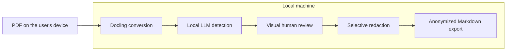
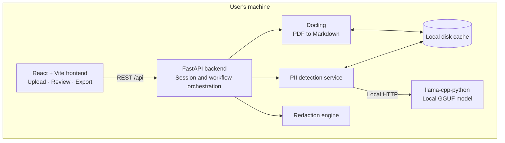

<div align="center">
  

# RedactGuard

**Local-first, human-reviewed document anonymization for sensitive PDFs.**

RedactGuard detects personal and sensitive information with a local LLM, lets the user review every finding, and exports a safer Markdown version without sending the document to a cloud AI provider.

[How it works](#how-it-works) · [Run locally](#run-locally) · [Architecture](#architecture) · [Privacy model](#privacy-and-data-lifecycle)
</div>

> [!IMPORTANT]
> RedactGuard is an experimental privacy tool, not a legal compliance product. Local AI can miss, misclassify, or over-detect sensitive information. Every result must be reviewed by a person before the exported document is shared or relied upon.

## Why RedactGuard exists

Professionals regularly need to share documents that contain names, contact details, account identifiers, health information, measurements, dates, or other sensitive data.

The usual alternatives create difficult trade-offs:

- manual redaction is slow and easy to perform inconsistently;
- basic pattern matching cannot reliably understand contextual or domain-specific information;
- cloud-based AI tools require the original document to leave the user's machine;
- fully automatic redaction removes human control precisely where mistakes matter most.

RedactGuard is designed around a different principle:

> **Use local AI to accelerate sensitive-data detection, but keep the final decision with the user.**

The objective is not to make an unverifiable promise of automatic anonymity. The objective is to make document minimization more private, inspectable, and practical before a file is shared, archived, or used in another workflow.

## What RedactGuard does

RedactGuard provides an end-to-end local workflow:

1. **Import a PDF** and select the most appropriate detection profile.
2. **Convert the document to structured Markdown** with Docling.
3. **Analyze selected pages or the whole document** with a locally hosted GGUF model.
4. **Highlight detected sensitive fields** by category and page.
5. **Review each finding** and decide what should or should not be redacted.
6. **Apply deterministic replacements** to the selected fields.
7. **Export an anonymized Markdown file** for safer downstream use.



## The value it adds

| Need | RedactGuard's contribution |
|---|---|
| Protect documents before sharing | Sensitive information can be reviewed and removed before the content enters another system. |
| Avoid cloud exposure | PDF conversion, inference, review, redaction, and export run on the user's machine. |
| Go beyond regex-only detection | A local LLM can identify contextual information such as health conditions, treatments, demographics, or measurements. |
| Preserve human control | Findings are suggestions, not irreversible decisions. Every field can be included or excluded from redaction. |
| Adapt detection to the document | Built-in profiles focus the model on general, healthcare, legal, or financial information. |
| Reduce repeated processing time | PDF conversion and LLM results are cached locally with configuration-aware keys and expiration policies. |
| Make privacy operational | The product combines data minimization, local processing, review, deletion controls, and explicit export into one workflow. |

## Core capabilities

### Local AI processing

- GGUF inference through `llama-cpp-python`;
- default support for NVIDIA Nemotron 3 Nano 4B Q4_K_M;
- configurable model path and inference parameters;
- local HTTP endpoints compatible with the app's LLM client;
- no cloud inference required for document processing.

### Structured document extraction

- PDF upload with file-size validation;
- PDF-to-Markdown conversion through Docling;
- page-level document representation;
- table normalization before PII analysis;
- SHA-256-based conversion cache.

### Domain-aware PII detection

Built-in YAML profiles are available for:

- **General** documents;
- **Healthcare** and clinical information;
- **Legal** and contractual documents;
- **Financial** and banking information.

The supported taxonomy includes categories such as:

- people, email addresses, phone numbers, addresses, dates, and URLs;
- account numbers and secrets;
- health conditions, treatments, and laboratory results;
- personal measurements, demographics, and lifestyle information.

The backend also exposes APIs for defining additional custom PII types.

### Human-in-the-loop review

- color-coded highlights in the document preview;
- per-field redaction controls;
- page-by-page analysis;
- selective page inference;
- sequential batch scanning of the whole document;
- cross-page findings in a unified sidebar;
- navigation directly from a finding to its source page.

### Controlled export

- redaction is applied only after user confirmation;
- findings default to redacted unless explicitly excluded;
- replacements are applied deterministically from the reviewed field list;
- the current export format is Markdown (`.md`);
- exported files use an `_anonymized.md` suffix.

### Local caching

RedactGuard maintains separate caches for:

- PDF conversion results;
- LLM inference results.

Cache keys include the source content and relevant model or prompt configuration. This means a model, prompt, profile, or custom-type change naturally produces a new result instead of reusing an incompatible cached response.

## Privacy and data lifecycle

RedactGuard is local-first by architecture, but local processing does not mean that data disappears automatically. The application makes its local data lifecycle explicit.

| Data | Where it is handled | Default lifecycle | User control |
|---|---|---|---|
| Uploaded PDF | Local backend process | Held for the active document session | Delete/reset the session or stop the application |
| Parsed document pages | In-memory session and optional local cache | Session expires after inactivity; cache uses a TTL | Clear cache through the UI/API |
| PII findings | In-memory session and optional local cache | Session- and cache-bound | Review, override, clear cache |
| Exported Markdown | User-selected local destination | Persists until the user deletes it | Full filesystem control |
| GGUF model | Local model directory | Persists for reuse | Replace or delete the model |

Default behavior:

- services bind to `127.0.0.1`;
- document sessions are stored in memory rather than in a database;
- idle sessions are cleaned up automatically;
- cache data is stored locally under `~/.cache/redactguard` by default;
- PDF and LLM caches have configurable TTL and size limits;
- the cache can be cleared by namespace or in full;
- no user account, remote database, or cloud document store is required.

The first model download can contact Hugging Face. Once the model and dependencies are available, the document-processing workflow is designed to run locally.

> [!NOTE]
> Do not place the cache directory on shared or network-mounted storage when processing sensitive documents. Clear the cache after high-sensitivity sessions when local persistence is not desired.

## Architecture

RedactGuard uses three local processes with explicit responsibilities.



| Process | Default port | Responsibility |
|---|---:|---|
| React/Vite frontend | `3000` | Upload, profile selection, review, redaction controls, and export UI |
| FastAPI backend | `8000` | Document sessions, conversion, analysis orchestration, redaction, profiles, cache, and export |
| Local LLM server | `1235` | Loads the GGUF model and performs local inference |

### Main technologies

- **Frontend:** React 19, TypeScript, Vite, Tailwind CSS v4, Motion, Lucide;
- **Backend:** Python 3.13, FastAPI, Pydantic;
- **Document processing:** Docling;
- **Local inference:** `llama-cpp-python` with GGUF models;
- **PII taxonomy:** OpenAI Privacy Filter dependency and RedactGuard profiles;
- **Caching:** `diskcache`;
- **Desktop packaging:** Tauri 2, currently experimental.

## Run locally

The source workflow is currently oriented toward macOS development, particularly Apple Silicon. Linux and Windows are architectural targets, but may require platform-specific dependency and inference configuration.

### Prerequisites

- Git;
- Node.js 20 or newer;
- pnpm 9;
- Python 3.13;
- enough RAM for the selected GGUF model;
- a C/C++ build toolchain required by `llama-cpp-python` and Docling dependencies.

On macOS, install the main tools with Homebrew:

```bash
brew install node pnpm python@3.13
```

### 1. Clone the repository

```bash
git clone https://github.com/daniele21/redact-guard.git
cd redact-guard
```

### 2. Create the Python environment

```bash
chmod +x setup_env.sh
./setup_env.sh
```

The script creates `.venv`, installs the backend dependencies, and enables Metal support for `llama-cpp-python` on macOS.

### 3. Install the frontend dependencies

```bash
pnpm install
```

### 4. Provide a GGUF model

Download the default model:

```bash
pnpm tauri:download-model
```

By default, the downloader stores it at:

```text
~/.redactguard/models/NVIDIA-Nemotron-3-Nano-4B-Q4_K_M.gguf
```

Then point the local LLM server to it with an environment variable:

```bash
export NEMOTRON_GGUF_PATH="$HOME/.redactguard/models/NVIDIA-Nemotron-3-Nano-4B-Q4_K_M.gguf"
```

You can use another compatible GGUF model by setting `NEMOTRON_GGUF_PATH` to its absolute path. Model and runtime defaults can also be changed in [`config.json`](config.json).

> [!WARNING]
> The default model downloader does not currently enforce SHA-256 verification unless a hash is explicitly supplied. Verify model artifacts independently before using them in sensitive or production-like workflows.

### 5. Start the complete development stack

```bash
pnpm start
```

This starts:

- the local LLM server on `http://127.0.0.1:1235`;
- the FastAPI backend on `http://127.0.0.1:8000`;
- the Vite frontend on `http://localhost:3000`.

Open:

```text
http://localhost:3000
```

API documentation is available at:

```text
http://127.0.0.1:8000/docs
```

No Gemini API key is required for the documented local inference workflow.

## Desktop development

Tauri packaging is under active development.

Run the desktop shell in development mode:

```bash
pnpm tauri:dev
```

Build the frontend and Tauri application:

```bash
pnpm tauri:build
```

Build the Python backend sidecar used by the desktop package:

```bash
pnpm tauri:build-sidecar
```

Desktop packaging should currently be considered experimental until model distribution, artifact verification, cross-platform testing, code signing, and release automation are complete.

## Configuration

Most runtime settings are centralized in [`config.json`](config.json) and can be overridden with environment variables.

| Environment variable | Purpose |
|---|---|
| `NEMOTRON_GGUF_PATH` | Absolute path to the local GGUF model |
| `NEMOTRON_PROXY_HOST` | LLM server bind address |
| `NEMOTRON_PROXY_PORT` | LLM server port |
| `LLAMA_CPP_CTX_SIZE` | Model context size |
| `CACHE_ENABLED` | Enable or disable all local caches |
| `CACHE_DIR` | Change the local cache directory |
| `PDF_CACHE_TTL_DAYS` | PDF conversion cache lifetime |
| `LLM_CACHE_TTL_DAYS` | LLM result cache lifetime |
| `SESSION_TTL_MINUTES` | Idle document-session lifetime |
| `MAX_FILE_SIZE_MB` | Maximum accepted PDF size |
| `LLM_ENDPOINT` | Backend endpoint for local inference |
| `LLM_TIMEOUT` | LLM request timeout |

The default hardware values in `config.json` are tuned for the original development environment. Adjust GPU layers, thread count, batch sizes, and context size to match your hardware.

## API overview

| Method | Endpoint | Purpose |
|---|---|---|
| `GET` | `/api/health` | Backend, model, and cache health |
| `POST` | `/api/upload` | Upload and convert a PDF |
| `POST` | `/api/analyze/{doc_id}/page/{page}` | Analyze one page |
| `POST` | `/api/analyze/{doc_id}` | Analyze the full document sequentially |
| `PATCH` | `/api/redact/{doc_id}` | Store user redaction choices and apply them |
| `GET` | `/api/export/{doc_id}?format=md` | Download anonymized Markdown |
| `GET` | `/api/profiles` | List detection profiles |
| `GET` | `/api/profiles/{name}` | Read profile details |
| `GET/POST/DELETE` | `/api/profiles/custom-types` | Manage custom PII definitions |
| `GET` | `/api/cache/stats` | Inspect cache usage and savings |
| `DELETE` | `/api/cache` | Clear all cache namespaces |

## Repository structure

```text
redact-guard/
├── src/                         # React application
│   ├── components/              # Upload, review, export, setup, and layout UI
│   ├── hooks/                   # Document workflow state
│   ├── services/                # Typed API client
│   └── config/                  # Shared frontend configuration
├── anonimizer/                  # Python local-processing backend
│   ├── api/                     # FastAPI routes
│   ├── cache/                   # Persistent local cache
│   ├── domain/                  # Models and PII types
│   ├── pii_profiles/            # General, healthcare, legal, financial profiles
│   ├── services/                # Conversion, detection, redaction, export, sessions
│   ├── llama_cpp_server.py      # Local GGUF inference server
│   └── main.py                  # FastAPI application entrypoint
├── src-tauri/                   # Experimental desktop shell and sidecar packaging
├── scripts/                     # Model download, cache, and build utilities
├── product/                     # Product brief and source-of-truth intent
├── docs/00-discovery/           # Strategy, architecture, and delivery analysis
├── config.json                  # Shared runtime and UI configuration
└── package.json                 # Frontend and multi-process development scripts
```

## Current limitations

RedactGuard currently has important limitations that should be understood before use:

- only PDF input is supported;
- the exported artifact is Markdown, not a visually redacted PDF;
- layout and images from the original PDF are not preserved in the export;
- local model quality depends on model, quantization, prompt, language, and document structure;
- OCR and complex chart extraction depend on Docling's conversion quality;
- automated detection can produce false positives and false negatives;
- the default model is relatively demanding for low-memory hardware;
- document history and a formal audit trail are not implemented;
- multi-document batch processing is not implemented;
- authentication is intentionally absent because the current deployment model is local single-user;
- desktop packaging and model integrity verification are not yet production-ready.

## Project status and direction

RedactGuard is an active experimental project and a reference implementation for privacy-first AI products.

The most important next steps are:

- benchmark PII detection quality across document domains and model quantizations;
- add regression datasets for false positives and false negatives;
- export a redacted PDF while preserving layout;
- complete cryptographically verified model distribution;
- harden and test Tauri packaging across operating systems;
- improve cleanup, deletion, and audit visibility for sensitive workflows;
- separate reusable PII detection/redaction capabilities from the product UI where real reuse emerges.

See [`CHANGELOG.md`](CHANGELOG.md) for implemented product changes and [`docs/00-discovery`](docs/00-discovery) for the architecture and delivery rationale.

## Security and responsible use

- Do not expose the local services to untrusted networks.
- Do not assume that a successful model response means every sensitive field was detected.
- Review all findings and the final exported document manually.
- Delete local caches and exports according to the sensitivity and retention requirements of your use case.
- Do not use RedactGuard as evidence of GDPR compliance, anonymization certification, or legal sufficiency without an independent assessment.
- Report security issues privately rather than opening an issue that contains sensitive documents or personal data.

---

<div align="center">
  <strong>RedactGuard</strong> explores how local AI, data minimization, and human review can work together before sensitive documents leave the user's control.
</div>
