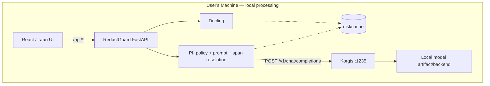
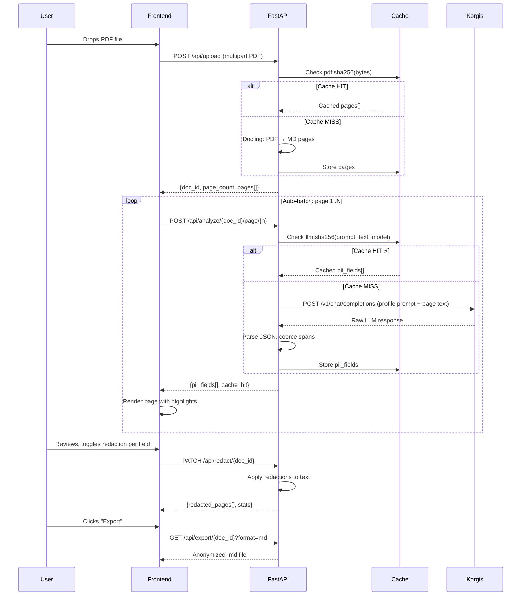
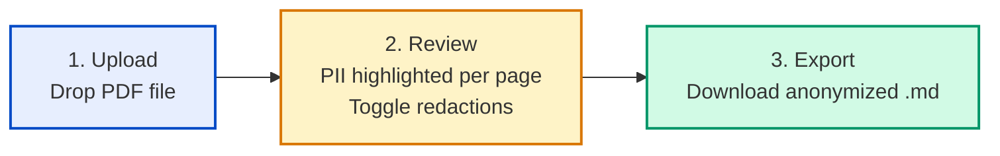

# RedactGuard — Solution Strategy

> Status: **Approved** — ready for delivery planning.

## 1. Architecture Overview

### RedactGuard + external Korgis local architecture



| Process | Tech | Port | Role |
|---|---|---:|---|
| **Korgis** | external local runtime | `:1235` | Model registry, artifacts, lifecycle, backend selection, inference, runtime identity |
| **Backend API** | FastAPI | `:8000` | PDF→MD→PII policy/prompt→span resolution→redaction→export |
| **Frontend** | Vite/React or Tauri WebView | `:3000` in dev | Configuration, upload, review and export |

### Key architectural choices

- **Korgis is the only model runtime authority** — RedactGuard does not embed `llama-cpp-python`, GGUF download logic or a private model server.
- **Public HTTP boundary only** — inference uses `POST /v1/chat/completions`; readiness/evidence use `GET /v1/models` and `GET /v1/runtime/identity`.
- **No silent substitution** — RedactGuard requests a configured Korgis model key and exposes offline/not-resident states.
- **No database** — in-memory document sessions with auto-cleanup.
- **Disk-persistent cache** — `diskcache` survives application restarts; model + prompt + policy remain part of cache identity.
- **Human review remains authoritative** — model findings are suggestions, deterministic redaction happens after review.

Current compatibility baseline: `daniele21/korgis@26a161dc0ef89a133c7a076d3a31544a274c1469` (`dev`).

---

## 2. Backend Architecture

### 2.1 Module structure

```
anonimizer/
├── __init__.py
├── config.py                    # All configuration: ports, model, cache, timeouts
├── main.py                      # FastAPI app entrypoint + CORS + lifespan
├── pii_profiles/                # YAML profile definitions
│   ├── healthcare.yaml          # Medical/clinical PII types
│   ├── legal.yaml               # Legal/contractual PII types
│   ├── financial.yaml           # Financial/banking PII types
│   └── general.yaml             # General-purpose PII types
│
├── cache/
│   ├── __init__.py
│   ├── cache_manager.py         # CacheManager class: disk-persistent, multi-namespace
│   ├── keys.py                  # SHA-256 cache key builders
│   └── stats.py                 # Hit/miss counters, estimated time saved
│
├── domain/
│   ├── __init__.py
│   ├── models.py                # Pydantic: DocumentSession, Page, PIIField, ExportResult
│   └── pii_types.py             # PII type registry, profile loading, prompt builder
│
├── services/
│   ├── __init__.py
│   ├── pdf_converter.py         # PDF → Markdown pages via Docling (cached)
│   ├── pii_detector.py          # Korgis-backed PII detection (cached)
│   ├── profile_service.py       # Profile CRUD: load YAML, merge custom types, save
│   ├── prompt_builder.py        # Dynamic system prompt from active profile + custom types
│   ├── redaction_engine.py      # Apply redactions, generate redacted text
│   └── export_service.py        # Generate anonymized .md file
│
├── api/
│   ├── __init__.py
│   ├── routes_health.py         # GET  /api/health
│   ├── routes_upload.py         # POST /api/upload (includes profile selection)
│   ├── routes_analyze.py        # POST /api/analyze/{doc_id}/page/{n}, POST /api/analyze/{doc_id}
│   ├── routes_redact.py         # PATCH /api/redact/{doc_id}
│   ├── routes_export.py         # GET  /api/export/{doc_id}
│   ├── routes_profiles.py       # GET/POST /api/profiles, custom type CRUD
│   └── routes_cache.py          # GET  /api/cache/stats, DELETE /api/cache
│
└── utils/
    ├── __init__.py
    ├── json_utils.py            # JSON extraction, nested payload search
    ├── markdown_utils.py        # Table normalization, slugify
    └── span_utils.py            # Whitespace-normalized span matching, offset coercion
```

### 2.2 API contract

| Method | Path | Description | Response |
|--------|------|-------------|----------|
| `GET` | `/api/health` | Backend + Korgis/model readiness | `{status, llm_status, model, korgis_protocol_version, cache_stats}` |
| `POST` | `/api/upload` | Upload PDF → convert to MD | `{doc_id, page_count, pages[], profile}` |
| `POST` | `/api/analyze/{doc_id}/page/{n}` | Analyze one page | `{page_number, pii_fields[], has_pii, cache_hit}` |
| `POST` | `/api/analyze/{doc_id}` | Analyze all pages (batch) | `{pages[{page_number, pii_fields[], cache_hit}]}` |
| `PATCH` | `/api/redact/{doc_id}` | Set redaction choices | `{redacted_pages[{number, text}], stats}` |
| `GET` | `/api/export/{doc_id}?format=md` | Download anonymized MD | `application/octet-stream` |
| `DELETE` | `/api/documents/{doc_id}` | Remove document session | `{ok}` |
| `GET` | `/api/profiles` | List available profiles | `{profiles[{name, description, pii_type_count}]}` |
| `GET` | `/api/profiles/{name}` | Profile detail with PII types | `{name, description, pii_types[]}` |
| `GET` | `/api/profiles/custom-types` | List user-defined custom types | `{custom_types[{name, description}]}` |
| `POST` | `/api/profiles/custom-types` | Add a custom PII type | `{name, description, created}` |
| `DELETE` | `/api/profiles/custom-types/{name}` | Remove a custom PII type | `{removed}` |
| `GET` | `/api/cache/stats` | Cache statistics | `{pdf_cache, llm_cache, time_saved_s}` |
| `DELETE` | `/api/cache` | Clear all caches | `{cleared}` |
| `DELETE` | `/api/cache/{namespace}` | Clear specific cache | `{cleared, entries_removed}` |

### 2.3 Data flow



### 2.4 Document session model

```python
@dataclass
class DocumentSession:
    """In-memory document session. No database needed."""
    doc_id: str                                    # UUID
    original_filename: str
    file_hash: str                                 # SHA-256 of PDF bytes
    pages: list[PageMarkdown]                      # Extracted markdown pages
    preprocessed_pages: list[PageMarkdown]          # Table-normalized pages
    pii_results: dict[int, list[PIIField]]          # page_number → detected fields
    redaction_overrides: dict[str, bool]             # field_id → should_redact?
    created_at: datetime
    last_accessed_at: datetime
```

Auto-cleanup: background task purges sessions idle for >30 minutes (configurable).

### 2.5 Configuration (`config.py`)

```python
@dataclass
class AppConfig:
    """Centralized backend configuration."""

    # Server
    host: str = "127.0.0.1"
    port: int = 8000
    cors_origins: list[str] = field(default_factory=lambda: ["http://localhost:3000"])

    # Korgis runtime boundary
    korgis_base_url: str = "http://127.0.0.1:1235/v1"
    korgis_model: str = "nemotron-nano-4b"
    llm_timeout: int = 600
    llm_max_output_tokens: int = 1024

    # Cache
    cache_enabled: bool = True
    cache_dir: str = ".cache/redactguard"
    pdf_cache_max_size_mb: int = 500
    pdf_cache_ttl_days: int = 7
    llm_cache_max_size_mb: int = 200
    llm_cache_ttl_days: int = 30

    # Sessions
    session_ttl_minutes: int = 30
    max_file_size_mb: int = 50

    # Upload
    allowed_extensions: list[str] = field(default_factory=lambda: [".pdf"])
```

---

## 3. Cache Architecture

### 3.1 Three-layer design

| Layer | What | Key | Storage | TTL | Savings |
|-------|------|-----|---------|-----|---------|
| **L1: PDF Conversion** | `file_bytes → pages[]` | `sha256(file_bytes)` | `diskcache` disk | 7 days | 5-30s per PDF |
| **L2: LLM Inference** | `(prompt+text+model) → pii_fields[]` | `sha256(prompt+text+model)` | `diskcache` disk | 30 days | **10-60s per page** |
| **L3: Frontend** | API responses | `doc_id:page_number` | In-memory Map | Session | Eliminates duplicate API calls |

### 3.2 Why caching is safe here

- `temperature=0.0` (default) → **deterministic** LLM output
- System prompt is **dynamically built** from profile + custom types, but deterministic for the same config
- PDF→MD conversion is deterministic → same file = same pages
- Model name is part of the cache key → model change auto-invalidates
- Profile change → different prompt → different cache key → auto-invalidation

### 3.3 Cache invalidation

| Trigger | Action |
|---------|--------|
| Model changed | LLM cache auto-invalidated (model is in the key) |
| System prompt changed | LLM cache auto-invalidated (prompt is in the key) |
| **Profile changed** | **LLM cache auto-invalidated** (prompt changes → key changes) |
| **Custom PII type added/removed** | **LLM cache auto-invalidated** (prompt changes → key changes) |
| TTL expired | Entry auto-evicted |
| Size limit exceeded | LRU eviction |
| User clicks "Clear Cache" | Full purge via API |
| New document upload | Frontend session cache cleared |

### 3.4 Impact

| Scenario | Without cache | With cache |
|----------|--------------|------------|
| First analysis 12p PDF | ~12 min | ~12 min (cold) |
| Re-upload same PDF | ~12 min | **~0.5s** |
| Server restart + re-upload | ~12 min | **~0.5s** (disk-persistent) |
| Navigate between pages | API call each time | **instant** (frontend cache) |

### 3.5 Privacy

Cache stores document content on disk locally. Mitigations:
- Directory is `.gitignored`
- Auto-expires via TTL
- "Clear Cache" button in UI and API
- Must not be on shared/networked storage

---

## 4. Frontend Architecture

### 4.1 Design system — Centralized tokens

All visual properties are defined in exactly **two places**:

**`src/index.css`** — CSS custom properties via Tailwind `@theme`:

```css
@theme {
  /* Typography */
  --font-sans: "Inter", sans-serif;

  /* Primary palette */
  --color-primary: #004ac6;
  --color-on-primary: #ffffff;
  --color-primary-container: #2563eb;

  /* Surface system */
  --color-surface: #f9f9ff;
  --color-surface-dim: #d3daea;
  --color-surface-container-lowest: #ffffff;
  --color-surface-container-low: #f0f3ff;
  --color-surface-container: #e7eefe;
  --color-surface-container-high: #e2e8f8;
  --color-surface-container-highest: #dce2f3;

  /* Text */
  --color-on-surface: #151c27;
  --color-on-surface-variant: #434655;
  --color-outline: #737686;
  --color-outline-variant: #c3c6d7;

  /* Feedback */
  --color-error: #ba1a1a;
  --color-success: #059669;
  --color-warning: #d97706;

  /* PII category colors — all centralized here */
  --color-pii-person: #3b82f6;
  --color-pii-contact: #8b5cf6;
  --color-pii-location: #06b6d4;
  --color-pii-date: #f59e0b;
  --color-pii-health: #ef4444;
  --color-pii-lab: #f97316;
  --color-pii-measurement: #14b8a6;
  --color-pii-secret: #6b7280;
}
```

**`src/config/theme.config.ts`** — Runtime PII type → color/icon mapping:

```typescript
export const PII_CATEGORIES = {
  private_person:       { color: 'pii-person',      icon: 'User',      label: 'Name' },
  private_email:        { color: 'pii-contact',     icon: 'Mail',      label: 'Email' },
  private_phone:        { color: 'pii-contact',     icon: 'Phone',     label: 'Phone' },
  private_address:      { color: 'pii-location',    icon: 'MapPin',    label: 'Address' },
  private_date:         { color: 'pii-date',        icon: 'Calendar',  label: 'Date' },
  health_condition:     { color: 'pii-health',      icon: 'Heart',     label: 'Health' },
  health_treatment:     { color: 'pii-health',      icon: 'Pill',      label: 'Treatment' },
  health_lab_result:    { color: 'pii-lab',          icon: 'FlaskConical', label: 'Lab' },
  personal_measurement: { color: 'pii-measurement', icon: 'Ruler',     label: 'Measurement' },
  personal_demographic: { color: 'pii-measurement', icon: 'Users',     label: 'Demographic' },
  account_number:       { color: 'pii-secret',      icon: 'CreditCard', label: 'Account' },
  secret:               { color: 'pii-secret',      icon: 'Key',       label: 'Secret' },
} as const;
```

**Rule**: Components **never** use raw hex values. They reference `bg-pii-person`, `text-primary`, etc. Changing `--color-primary` in `index.css` propagates everywhere instantly.

### 4.2 Component structure

```
src/
├── App.tsx                      # Root: step-based routing
├── main.tsx                     # React entrypoint
├── index.css                    # Design tokens (single source of truth)
│
├── config/
│   ├── app.config.ts            # API base URL, feature flags
│   └── theme.config.ts          # PII type → color/icon/label mapping
│
├── types/
│   └── index.ts                 # TypeScript interfaces: Document, Page, PIIField, Profile, etc.
│
├── hooks/
│   ├── useDocument.ts           # State machine: upload → analyze → review → export
│   ├── useProfiles.ts           # Profile list + custom type CRUD
│   └── useExport.ts             # Export download trigger
│
├── services/
│   └── api.ts                   # Typed fetch wrapper for FastAPI backend
│
├── components/
│   ├── layout/
│   │   ├── Navbar.tsx           # Top bar with app name + settings gear icon
│   │   ├── Footer.tsx           # Minimal footer
│   │   └── StepIndicator.tsx    # Visual 1-2-3 progress dots
│   │
│   ├── upload/
│   │   ├── DropZone.tsx         # Drag & drop + file picker
│   │   ├── FilePreview.tsx      # Selected file info card
│   │   ├── ProfileSelector.tsx  # Dropdown to choose detection profile
│   │   └── UploadProgress.tsx   # Conversion + analysis progress
│   │
│   ├── review/
│   │   ├── ReviewLayout.tsx     # Split panel: document + sidebar
│   │   ├── DocumentPanel.tsx    # Rendered markdown with PII highlights
│   │   ├── PageToolbar.tsx      # Page navigation bar
│   │   ├── PIISidebar.tsx       # PII list + category filters + toggles
│   │   ├── PIIFieldCard.tsx     # Single PII entity row
│   │   ├── PIIHighlight.tsx     # Inline colored highlight span
│   │   └── CacheIndicator.tsx   # Cache hit/miss status badge
│   │
│   ├── settings/
│   │   ├── SettingsModal.tsx    # Modal with profile info + custom type editor
│   │   ├── ProfileInfo.tsx      # Read-only list of active profile PII types
│   │   └── CustomTypeEditor.tsx # Add/remove custom PII types (name + description)
│   │
│   ├── export/
│   │   ├── ExportPreview.tsx    # Final anonymized text preview
│   │   ├── ExportActions.tsx    # Download button
│   │   └── ExportStats.tsx      # Redaction summary card
│   │
│   └── shared/
│       ├── Badge.tsx            # Status/category badge (uses PII colors)
│       ├── Button.tsx           # Configurable button variants
│       ├── Spinner.tsx          # Loading indicator
│       ├── EmptyState.tsx       # No-data placeholder
│       └── StatusBanner.tsx     # LLM connection status bar
```

### 4.3 UX flow — 3 linear steps



#### Step 1 — Upload

- **Profile selector dropdown** (Healthcare, Legal, Financial, General)
- Drag & drop zone with animated border
- PDF validation (extension + size limit)
- File preview card (name, size, page count)
- "Analyze" button starts upload + auto-batch
- Progress: "Converting PDF..." → "Analyzing page 3/12..."

#### Step 2 — Review (core screen)

```
┌──────────────────────────────────────────────────────────┐
│  ┌─ Step indicator: ● ─ ● ─ ○ ─────────────────────────┐│
│  │  Upload ─ Review ─ Export                            ││
│  └──────────────────────────────────────────────────────┘│
│                                                          │
│  ┌─ Page toolbar ──────────────────────────────────────┐ │
│  │  ◀ Page 1/5 ▶   │  Progress: ████░░ 3/5 analyzed   │ │
│  └─────────────────────────────────────────────────────┘ │
│                                                          │
│  ┌─ Document ────────────┐  ┌─ PII Sidebar ──────────┐  │
│  │                       │  │                         │  │
│  │  Markdown content     │  │ Summary                 │  │
│  │  with [highlighted]   │  │  12 fields · 4 types    │  │
│  │  PII spans            │  │                         │  │
│  │                       │  │ ┌─ Fields ────────────┐ │  │
│  │  Color-coded by       │  │ │ 👤 Mario Rossi  👁  │ │  │
│  │  PII category         │  │ │ 📧 m.rossi@... 👁  │ │  │
│  │                       │  │ │ 📅 03/01/2025  👁  │ │  │
│  │  Live redaction        │  │ │ 🏥 diabete t2  👁  │ │  │
│  │  preview when toggled │  │ └────────────────────┘ │  │
│  │                       │  │                         │  │
│  │                       │  │ [Redact All] [Keep All] │  │
│  │                       │  │                         │  │
│  │                       │  │ ⚡ Cache: 4/5 from cache│  │
│  │                       │  │                         │  │
│  │                       │  │ [Export Anonymized MD]  │  │
│  └───────────────────────┘  └─────────────────────────┘  │
└──────────────────────────────────────────────────────────┘
```

**Key interactions:**
- PII highlights: color-coded inline spans (configurable via `theme.config.ts`)
- Toggle redaction: eye icon per field → instant preview update
- Batch actions: "Redact All" / "Keep All" buttons
- Page navigation: arrow buttons with analysis progress per page
- Cache indicator: shows how many pages came from cache

#### Step 3 — Export

- Preview of anonymized markdown (read-only)
- Download button → browser downloads `.md` file
- Stats card: "12 fields redacted across 5 pages"
- Back button to return to review

### 4.4 Responsive behavior

| Breakpoint | Layout |
|------------|--------|
| Desktop (≥1024px) | Side-by-side: document panel + PII sidebar |
| Tablet (768-1023px) | Sidebar collapses to bottom sheet |
| Mobile (<768px) | Full-width stacked: document → sidebar (toggle) |

---

## 5. PII Profile System

### 5.1 How it works

The system prompt sent to the LLM is **dynamically built** from two sources:

```
Final Prompt = Base Profile PII types + User Custom PII types
               ────────────────────   ─────────────────────
               (from YAML file)       (from UI editor, saved as JSON on disk)
```

### 5.2 Profile YAML format

```yaml
# pii_profiles/healthcare.yaml
name: Healthcare
description: "PII detection optimized for medical and clinical documents."
pii_types:
  private_person:
    label: "Person Name"
    description: "Person name: patient, client, relative, or healthcare professional."
    examples: ["Mario Rossi", "Dr. Bianchi"]
    color: "pii-person"
    icon: "User"
  health_condition:
    label: "Health Condition"
    description: "Diagnosis, symptom, allergy, intolerance, or clinical history."
    examples: ["diabete tipo 2", "ipertensione"]
    color: "pii-health"
    icon: "Heart"
  # ... other types per profile
```

### 5.3 Custom PII types (user-defined via UI)

Users can add domain-specific types via a simple form in the Settings modal:
- **Name**: machine-readable key (e.g. `company_name`)
- **Description**: natural-language definition the LLM uses to identify the entity

Custom types are saved to `data/custom_pii_types.json` on disk and persist across sessions.

```json
[
  {
    "name": "company_name",
    "description": "Name of the company, organization, or business entity.",
    "color": "pii-custom",
    "icon": "Building2"
  },
  {
    "name": "contract_number",
    "description": "Contract, agreement, or business reference identifier.",
    "color": "pii-custom",
    "icon": "FileText"
  }
]
```

### 5.4 Dynamic prompt builder

The `prompt_builder.py` service merges profile types + custom types into the system prompt:

```python
def build_system_prompt(profile_name: str, custom_types: list[CustomPIIType]) -> str:
    profile = load_profile(profile_name)
    all_types = profile.pii_types + custom_types

    type_instructions = "\n".join(
        f"- {t.name}: {t.description}" for t in all_types
    )

    return f"""You are a PII detection assistant.
Analyze the text and identify all personally identifiable information.

PII types to detect:
{type_instructions}

Return a JSON object with a 'pii_fields' array..."""
```

### 5.5 Cache compatibility

The system prompt is part of the LLM cache key: `sha256(prompt + text + model)`. Therefore:
- **Changing profile** → different prompt → different cache key → no stale results
- **Adding/removing custom type** → different prompt → different cache key → no stale results
- **Same profile + same custom types + same text** → cache hit → instant result

---

## 6. Rejected Alternatives

| Alternative | Why rejected |
|-------------|-------------|
| WebSocket streaming | Over-engineering. Sequential fetch loop gives the same UX. |
| Redis/Memcached | External dependency. `diskcache` is simpler, local-only, no server. |
| Vanilla CSS | Tailwind v4 already configured. `@theme` gives centralized control. |
| PDF export in v1 | Non-trivial, adds large dependencies. Markdown is sufficient for MVP. |
| Database (SQLite/Postgres) | No persistence needed. In-memory sessions with auto-cleanup suffice. |
| Cloud LLM fallback | Violates core privacy promise. |
| Embedded RedactGuard LLM server | Duplicates lifecycle, artifact and backend responsibility already owned by Korgis. |
| Full PII type CRUD editor in v1 | Too complex. Profile selector + custom type addition covers all cases. |

---

## 7. Accepted Tradeoffs

| Tradeoff | Accepted risk | Mitigation |
|----------|--------------|------------|
| LLM inference is slow on CPU | 10-60s per page | Cache eliminates re-analysis. Progress bar keeps user informed. |
| In-memory sessions are volatile | Server restart loses active sessions | Cache preserves analysis results. User can re-upload and get instant results. |
| No PDF export | Some users may want PDF | Markdown is portable. PDF export can be added in v2. |
| Single-model default | Nemotron may not be best for all document types | `KORGIS_MODEL` is configurable and the benchmark compares Korgis-managed local models. |
| Cache stores PII on disk | Security concern if machine is shared | `.gitignored`, TTL auto-expire, manual clear button, local-only directory. |
| Custom types can confuse the LLM | Poorly defined types may produce bad results | Clear description guidance in UI, validation on backend |

---

## 8. Security & Privacy Baseline

- **No cloud document inference** — document content is processed by local RedactGuard + local Korgis; Korgis may use the network only when explicitly acquiring model artifacts
- **No persistent storage of documents** — sessions are ephemeral (in-memory)
- **Cache is local disk only** — `.gitignored`, auto-expires, user can clear
- **No authentication needed** — localhost-only, single-user
- **No logging of PII** — logs contain only metadata (page count, timing, cache stats)
- **CORS restricted** — only `localhost:3000` can access the API
- **Custom types file is local** — saved in `data/` dir, `.gitignored`
