# RedactGuard — Delivery Plan

> Status: **Active** — Korgis runtime migration is the current architecture baseline.
> Dependencies: Solution strategy approved (see `01-solution-strategy.md`)

## Overview

### Runtime migration slice — 2026-09

- RedactGuard owns policy, prompts, document processing, deterministic span resolution, review and redaction.
- Korgis owns model artifacts, backend selection, lifecycle, inference and runtime identity.
- Remove active `llama_cpp_server.py`/GGUF downloader paths and route inference through `/v1/chat/completions`.
- Surface Korgis offline and model-not-resident states explicitly in the UI.
- Validate against `daniele21/korgis@26a161dc0ef89a133c7a076d3a31544a274c1469`.


The implementation is divided into **4 phases**, each producing a testable, self-contained increment. Phases are sequential — each builds on the previous one.

```mermaid
gantt
    title RedactGuard Delivery Phases
    dateFormat  X
    axisFormat %s
    
    section Phase 1
    Backend foundation + cache      :p1, 0, 3
    
    section Phase 2
    PII detection API               :p2, after p1, 3
    
    section Phase 3
    Frontend integration            :p3, after p2, 4
    
    section Phase 4
    Export + polish                  :p4, after p3, 2
```



---

## Phase 1 — Backend Foundation + Cache Layer

**Goal**: FastAPI server running with PDF upload, markdown conversion, caching, and health check.

### Slices

| # | Slice | Description | Output |
|---|-------|-------------|--------|
| 1.1 | **Modularize analyzer** | Split `analyze_pdf_pii.py` (880 lines) into `domain/`, `services/`, `utils/` modules | Clean module structure |
| 1.2 | **Config system** | Create `config.py` with `AppConfig` and `CacheConfig` dataclasses | Centralized configuration |
| 1.3 | **Cache layer** | Build `cache/cache_manager.py`, `cache/keys.py`, `cache/stats.py` using `diskcache` | Working cache with hit/miss tracking |
| 1.4 | **PII profiles** | Create `pii_profiles/*.yaml` (healthcare, legal, financial, general) + `profile_service.py` + `prompt_builder.py` | Profile system with dynamic prompt generation |
| 1.5 | **FastAPI bootstrap** | Create `main.py` with CORS, lifespan, error handling | Running server on `:8000` |
| 1.6 | **Upload endpoint** | `POST /api/upload` — accept PDF + profile, convert via Docling (cached), return pages | PDF → MD working via API |
| 1.7 | **Profiles API** | `GET /api/profiles`, `GET /api/profiles/{name}`, custom types CRUD | Profile management endpoints |
| 1.8 | **Health endpoint** | `GET /api/health` — check Korgis reachability, configured-model residency, runtime identity + cache stats | Health check working |

### Dependencies

- `diskcache`, `pyyaml` (new Python dependencies)
- `fastapi`, `uvicorn`, `python-multipart` (new Python dependencies)
- Existing: `docling`; Korgis is a separately installed/runtime-managed dependency, not a Python package dependency

### Definition of done

- [ ] `analyze_pdf_pii.py` logic split into ≤200-line modules
- [ ] `config.py` with all configurable values
- [ ] Cache stores and retrieves PDF conversion results
- [ ] 4 YAML profiles (healthcare, legal, financial, general) with distinct PII type sets
- [ ] `prompt_builder.py` generates system prompt from profile + custom types
- [ ] Custom PII types CRUD persists to `data/custom_pii_types.json`
- [ ] `POST /api/upload` accepts PDF + profile, returns `{doc_id, pages[], profile}`
- [ ] `GET /api/health` returns explicit Korgis/model readiness and identity protocol
- [ ] Requirements updated (`requirements.txt`)

---

## Phase 2 — PII Detection API

**Goal**: Full analyze → redact flow working via API. Cache integrated for LLM inference.

### Slices

| # | Slice | Description | Output |
|---|-------|-------------|--------|
| 2.1 | **Document session store** | In-memory `dict[str, DocumentSession]` with auto-cleanup task | Session management working |
| 2.2 | **Per-page analysis** | `POST /api/analyze/{doc_id}/page/{n}` — uses profile-aware prompt, call LLM, parse PII, cache | Single page analysis via API |
| 2.3 | **LLM cache integration** | Cache layer wraps `call_local_llm()` with SHA-256 key (includes prompt from profile) | Cache hits skip LLM entirely |
| 2.4 | **Batch analysis** | `POST /api/analyze/{doc_id}` — analyze all pages sequentially | All pages analyzed in one call |
| 2.5 | **Redaction endpoint** | `PATCH /api/redact/{doc_id}` — apply field toggles, return redacted text | Toggle redactions via API |
| 2.6 | **Cache stats endpoint** | `GET /api/cache/stats`, `DELETE /api/cache` | Cache monitoring |

### Dependencies

- Phase 1 complete
- Korgis running on `:1235` with the configured `KORGIS_MODEL` resident

### Definition of done

- [ ] Per-page analysis returns correct PII fields
- [ ] Second analysis of same page returns instantly (cache hit)
- [ ] Batch analysis works for multi-page PDFs
- [ ] Redaction toggles produce correct redacted text
- [ ] Cache stats endpoint returns hit/miss counts
- [ ] Session auto-cleanup purges idle sessions

### Testing

- Unit test: `pii_detector.py` with mocked LLM response
- Unit test: `cache_manager.py` set/get/evict/stats
- Unit test: `redaction_engine.py` toggle combinations
- Integration test: upload → analyze → redact flow

---

## Phase 3 — Frontend Integration

**Goal**: Real, working UI replacing current mocks. Connected to FastAPI backend.

### Slices

| # | Slice | Description | Output |
|---|-------|-------------|--------|
| 3.1 | **Cleanup scaffold** | Remove unused deps (`@google/genai`, `express`, `dotenv`), update `package.json` | Clean dependency list |
| 3.2 | **Design system** | Expand `index.css` `@theme` with PII colors. Create `theme.config.ts` and `app.config.ts` | Centralized tokens |
| 3.3 | **Types + API client** | Create `types/index.ts` and `services/api.ts` | Typed API layer |
| 3.4 | **Shared components** | Build `Button`, `Badge`, `Spinner`, `EmptyState`, `StatusBanner` | Reusable primitives |
| 3.5 | **Upload flow** | Real `DropZone`, `FilePreview`, `UploadProgress`. Actual PDF upload to backend. | Working upload |
| 3.6 | **Review flow** | `ReviewLayout`, `DocumentPanel` with highlights, `PIISidebar` with toggles. Auto-batch analysis. | Core review screen |
| 3.7 | **Vite proxy** | Configure Vite to proxy `/api` → `localhost:8000` | Frontend ↔ backend connected |
| 3.8 | **Step navigation** | `StepIndicator` + step-based routing in `App.tsx` | Linear 3-step flow |

### Dependencies

- Phase 2 complete (API endpoints available)

### Definition of done

- [ ] Upload screen: drag & drop PDF → file preview → "Analyze" button
- [ ] **Profile selector dropdown** in upload step
- [ ] Upload triggers real backend upload + auto-batch analysis
- [ ] Review screen shows real PII highlights from backend data
- [ ] PII sidebar shows detected entities grouped by type
- [ ] Toggle eye icon → document panel updates live
- [ ] "Redact All" / "Keep All" batch actions work
- [ ] Page navigation shows analysis progress
- [ ] Cache hit indicator visible in sidebar
- [ ] **Settings modal** accessible from navbar gear icon
- [ ] **Custom PII type editor** — add name + description, saved to backend
- [ ] Vite proxy routes `/api/*` to FastAPI
- [ ] No hardcoded colors — all from design tokens

### Testing

- Visual: verify PII highlights render with correct colors
- Visual: verify responsive layout at desktop/tablet/mobile breakpoints
- Functional: upload → analyze → toggle → verify redacted text

---

## Phase 4 — Export & Polish

**Goal**: Complete export flow, error states, animations, responsive design, and documentation.

### Slices

| # | Slice | Description | Output |
|---|-------|-------------|--------|
| 4.1 | **Export endpoint** | `GET /api/export/{doc_id}?format=md` — generate and serve anonymized markdown | Backend export working |
| 4.2 | **Export UI** | `ExportPreview`, `ExportActions`, `ExportStats`. Download button triggers file save. | Export screen complete |
| 4.3 | **Error states** | Error boundaries, API error display, LLM offline banner, upload failures | Graceful error handling |
| 4.4 | **Loading states** | Skeleton loaders for document panel, spinner for analysis, progress for batch | Polish loading UX |
| 4.5 | **Empty states** | No PII found, empty page, no document loaded | All edge cases covered |
| 4.6 | **Micro-animations** | Framer Motion: page transitions, sidebar expand, field toggle, progress bar | Premium feel |
| 4.7 | **Responsive pass** | Tablet sidebar collapse, mobile full-width layout, touch targets | Mobile-ready |
| 4.8 | **Documentation** | README update, startup instructions, configuration guide | User-ready docs |

### Dependencies

- Phase 3 complete (working UI)

### Definition of done

- [ ] Export downloads correct anonymized `.md` file
- [ ] All screens have loading, error, and empty states
- [ ] Animations are smooth and performant
- [ ] Layout works at desktop, tablet, and mobile widths
- [ ] README documents: prerequisites, startup commands (3 processes), configuration
- [ ] `.gitignore` includes `.cache/redactguard/`

---

## Cross-cutting Concerns

### Documentation updates per phase

| Phase | Docs to update |
|-------|---------------|
| 1 | `requirements.txt`, `config.py` inline docs |
| 2 | API endpoint docs (inline docstrings) |
| 3 | `package.json`, frontend component JSDoc |
| 4 | `README.md` (full), startup guide, config guide |

### Security work

| Phase | Security task |
|-------|--------------|
| 1 | CORS configuration, file size limits |
| 2 | Input validation on all endpoints, no PII in logs |
| 3 | Frontend: no sensitive data in console logs |
| 4 | Review: `.gitignore` cache dir, document security notes in README |

### Privacy work

| Phase | Privacy task |
|-------|-------------|
| 1 | Cache directory is local-only, `.gitignored` |
| 2 | Sessions auto-cleanup, no persistent PII storage |
| 3 | "All Local" badge visible in UI |
| 4 | Privacy note in README, cache clear instructions |

---

## Startup Model

Korgis is started separately because it is the shared local runtime authority:

```bash
cd ../korgis
git checkout 26a161dc0ef89a133c7a076d3a31544a274c1469
uv sync --frozen --extra dev
uv run --frozen local-llm download nemotron-nano-4b
uv run --frozen local-llm serve --model nemotron-nano-4b --no-download
```

Then RedactGuard starts only its own API and UI:

```bash
pnpm start
```

Tauri similarly starts only the RedactGuard API sidecar. It never spawns or downloads a second LLM runtime.

---

## Risk Register

| Risk | Phase | Impact | Mitigation |
|------|-------|--------|------------|
| Local inference too slow | 2 | Poor UX | Select/benchmark appropriate Korgis model/backend, cache results, show progress |
| Docling fails on complex PDFs | 1 | Lost pages | Graceful error per page, warning in UI |
| LLM returns malformed JSON | 2 | Analysis fails | Robust parsing already exists, add retry with backoff |
| Large PDFs exceed memory | 1 | Crash | Configurable file size limit (default 50MB) |
| Port conflicts | 1-3 | Can't start | All ports configurable in config files |
| `diskcache` corruption | 2 | Cache unusable | Auto-recreate on corruption, "Clear Cache" in UI |
